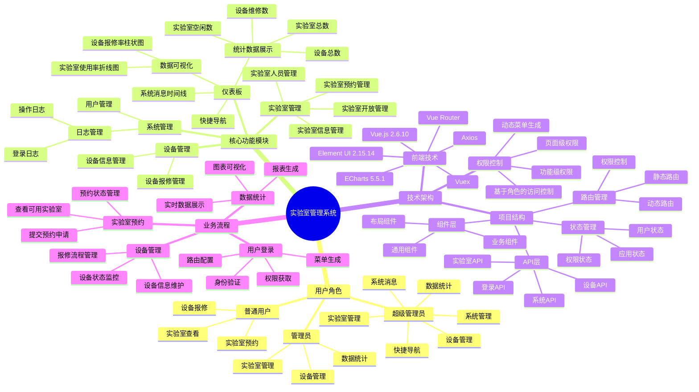

# 实验室管理系统功能架构

## 系统概览
基于 Vue.js 的实验室综合管理平台，支持多角色权限管理，提供实验室预约、设备管理、数据统计等核心功能。

## 功能思维导图

## 核心特性

| 模块 | 功能 | 权限 |
|------|------|------|
| 🏠 **仪表板** | 数据统计、图表展示、快捷导航 | 全角色 |
| 🏢 **实验室管理** | 信息管理、预约管理、开放管理、人员管理 | 管理员+ |
| 🔧 **设备管理** | 设备信息、报修流程 | 管理员+ |
| ⚙️ **系统管理** | 用户管理、日志管理 | 超级管理员 |

## 技术栈

**前端框架**: Vue.js 2.6.10 + Element UI 2.15.14  
**状态管理**: Vuex  
**路由管理**: Vue Router  
**数据可视化**: ECharts 5.5.1  
**HTTP客户端**: Axios  

## 权限体系

- **超级管理员** (roleId=1): 全功能权限
- **管理员** (roleId=2): 业务管理权限  
- **普通用户** (roleId=3): 基础查看和操作权限